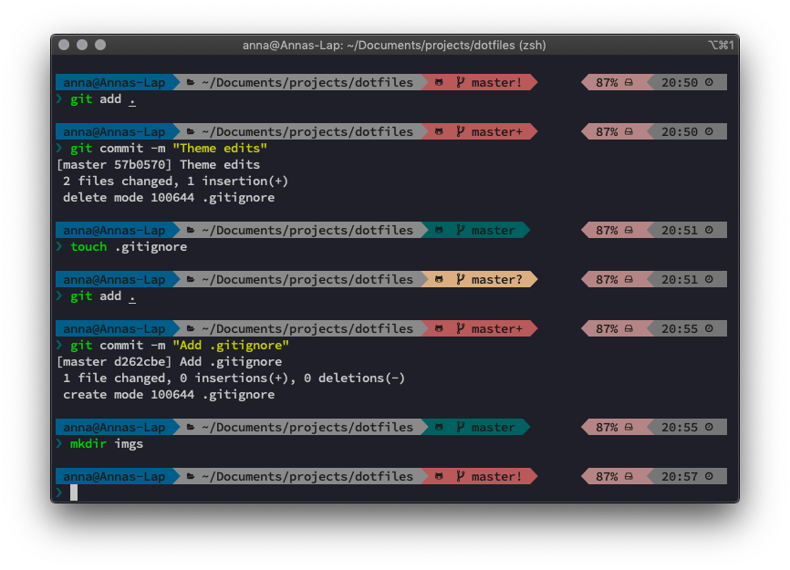

# Dotfiles!

For now just my `zsh` setup. 

You might have to install [oh_my_zsh](https://github.com/robbyrussell/oh-my-zsh) and the [Powerlevel9k zsh theme](https://github.com/Powerlevel9k) to use this setup.

