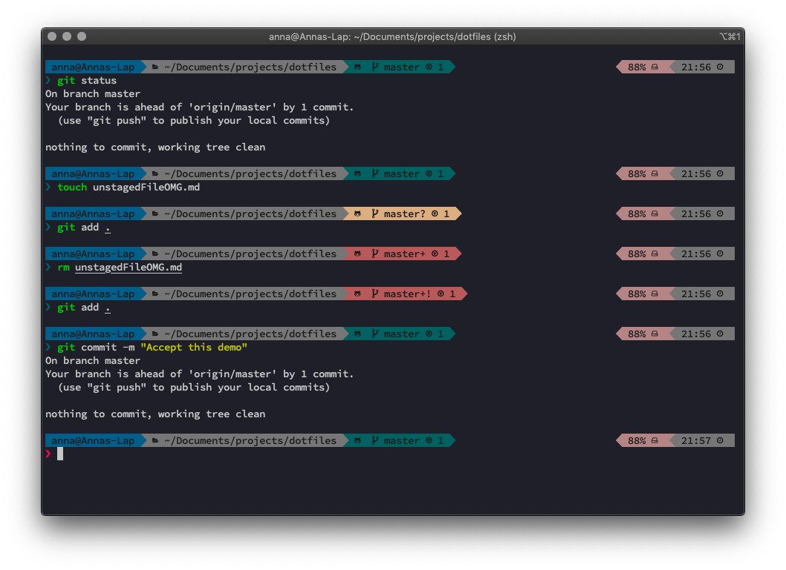

# Dotfiles!

For now this is just my `zsh` setup with custom segments and colours (plus some aliases and exports and other standard dotfile stuff). I set out to make it fairly minimal and subdued and to not clash with my favourite VSCode themes. Planning on adding a light theme eventually too.   
       
You might have to install [oh_my_zsh](https://github.com/robbyrussell/oh-my-zsh) and the [Powerlevel9k zsh theme](https://github.com/Powerlevel9k) to use this setup.

   
Pictured running on iTerm2 with background set to `1e2028` and `SauceCodePro Nerd Font`.

## Todo - light theme

use these flame glyphs as separators https://github.com/ryanoasis/powerline-extra-symbols 