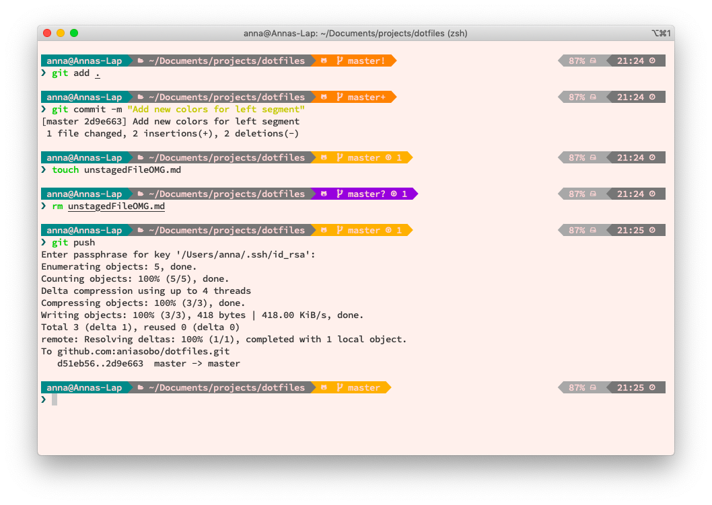

# Dotfiles!

For this `zsh` setup you might have to install [oh_my_zsh](https://github.com/robbyrussell/oh-my-zsh) and the [Powerlevel9k zsh theme](https://github.com/Powerlevel9k).

## Dark theme

Pictured running on iTerm2 with background set to `1e2028` and `SauceCodePro Nerd Font`.

## Light theme

This theme is meant to work well with the [VSCode Horizon](https://github.com/jolaleye/horizon-theme-vscode/) light theme

## TODO

use these flame glyphs as separators https://github.com/ryanoasis/powerline-extra-symbols
